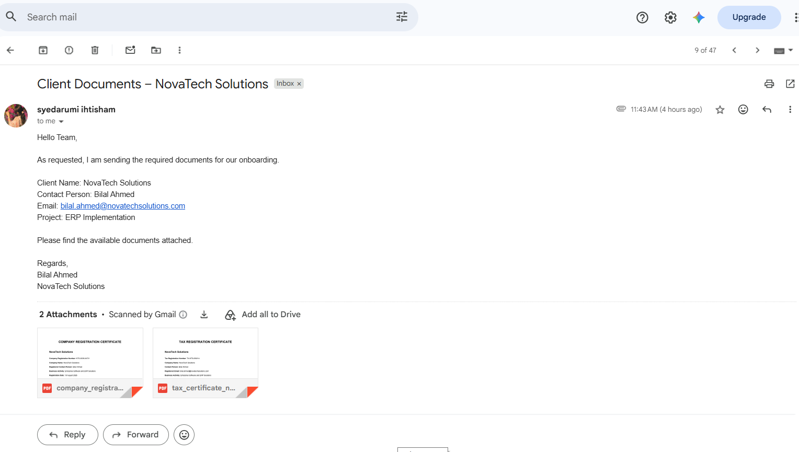
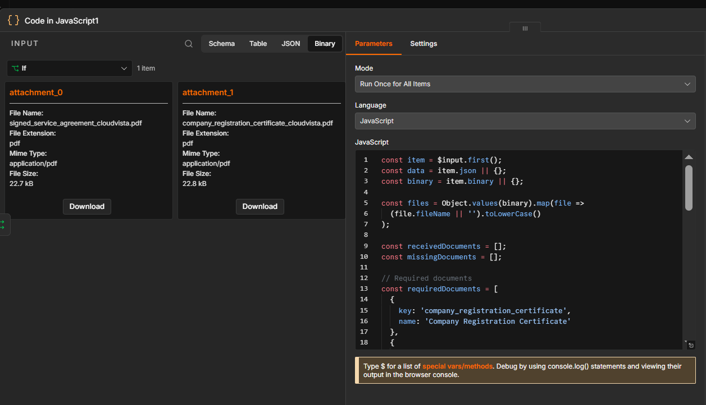
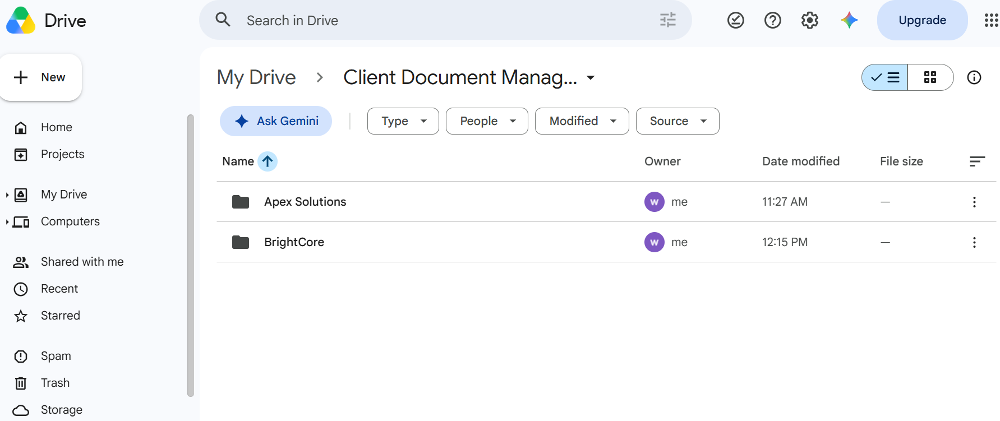
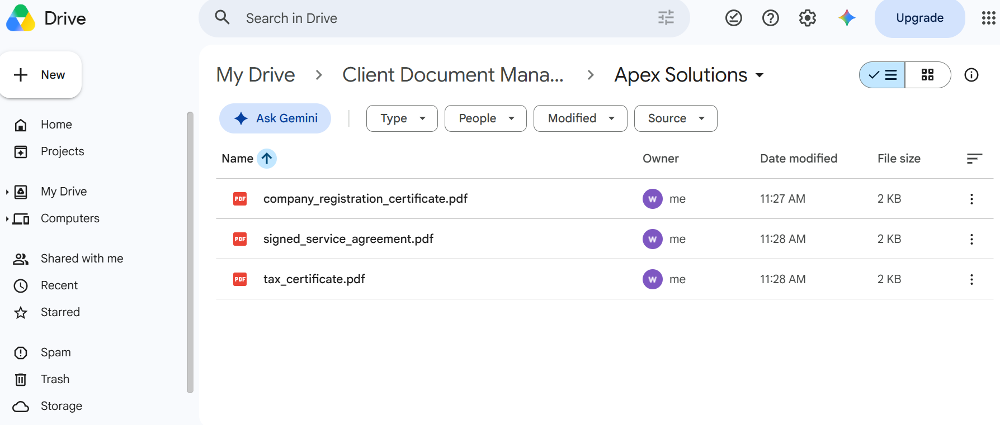
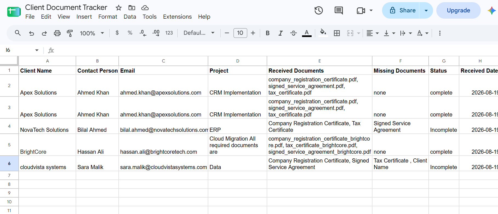
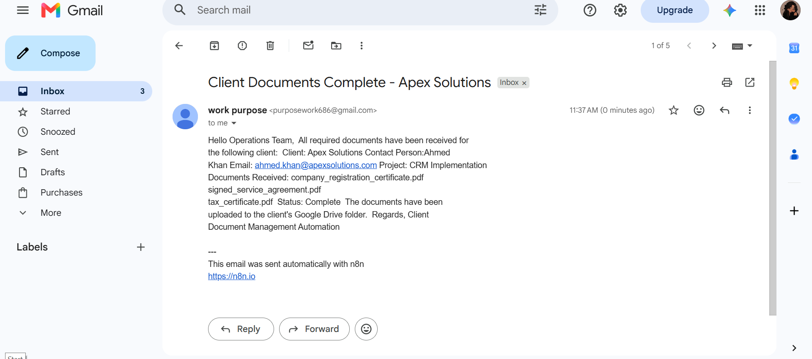
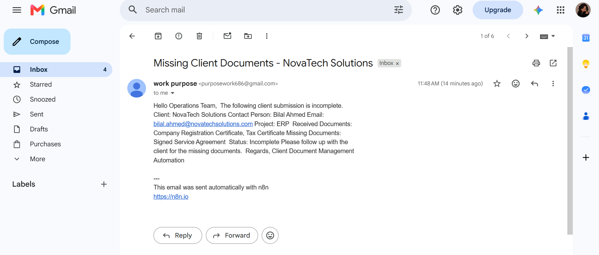

# 📄 Client Document Management Automation

An automated B2B client document management system built with n8n to receive, validate, organize, track, and communicate client document submissions.

The workflow ensures that the operations team always knows which documents have been received, which are missing, and whether required client information is complete.

## 🚀 Workflow Overview

The automation starts when a client sends an email containing onboarding documents.

Gmail Trigger
↓
Get Client Email
↓
Extract Client Data & Attachments
↓
Merge Data + Binary Files
↓
Validate Documents & Client Information
↓
IF
├── Complete
│   ├── Create Client Folder
│   ├── Upload PDFs
│   ├── Update Client Tracker
│   └── Send Completion Email
│
└── Incomplete
    ├── Calculate Received Documents
    ├── Calculate Missing Documents
    ├── Calculate Missing Information
    ├── Update Client Tracker
    └── Send Missing Information/Document Email

## ✨ Key Features

### 📧 Automated Email Processing

Automatically receives client document submissions through Gmail and processes the incoming email data and PDF attachments.

### 👤 Client Information Handling

The workflow processes important client information including:

- Client Name
- Contact Person
- Client Email
- Project

### 📎 Document Validation

The workflow checks for the required client documents:

- Company Registration Certificate
- Tax Certificate
- Signed Service Agreement

### 🔍 Missing Information Detection

The workflow checks whether required client information is available.

If information is missing, the workflow identifies the exact missing field.

### 📋 Received & Missing Document Detection

The automation calculates both:

- Documents received
- Documents still missing
- Missing client information

Multiple missing items can be identified in a single execution.

### 📁 Automated Google Drive Organization

When all required information and documents are available, the workflow automatically creates a dedicated client folder in Google Drive and uploads the received PDFs.

### 📊 Client Document Tracker

Google Sheets maintains a centralized record of every client submission.

The tracker records:

- Client Name
- Contact Person
- Email
- Project
- Received Documents
- Missing Documents
- Missing Information
- Status
- Received Date

### 📩 Automated Email Communication

The workflow automatically communicates with the client based on the submission status.

For complete submissions, a confirmation email is sent.

For incomplete submissions, an email is sent explaining the missing information and/or documents.

## 🧠 Validation Logic

### Required Client Information

- Client Name
- Contact Person
- Client Email
- Project

### Required Documents

- Company Registration Certificate
- Tax Certificate
- Signed Service Agreement

### Complete Submission

If all required information and documents are available:

Status: Complete

The workflow then:

1. Creates the client folder
2. Uploads the PDFs
3. Updates the Client Tracker
4. Sends a completion email

### Incomplete Submission

If any required information or document is missing:

Status: Incomplete

The workflow calculates:

- Received Documents
- Missing Documents
- Missing Information

The tracker is updated and the client receives an automated follow-up email.

## 📁 Google Drive Organization

Client documents are automatically organized into a dedicated client folder.

Example:

Client Document Management/
└── Apex Solutions/
    ├── company_registration_certificate.pdf
    ├── tax_certificate.pdf
    └── signed_service_agreement.pdf

## 📊 Client Tracker

The Google Sheets tracker provides the operations team with a clear view of each client's document status.

Example:

| Client | Received Documents | Missing Documents | Missing Information | Status |
|---|---|---|---|---|
| Apex Solutions | Company Registration, Tax Certificate, Service Agreement | None | None | Complete |
| NovaTech Solutions | Company Registration, Tax Certificate | Signed Service Agreement | None | Incomplete |
| CloudVista Systems | Company Registration, Signed Service Agreement | Tax Certificate | Client Name | Incomplete |

## 🔄 Test Scenarios

### ✅ Complete Submission

Client provides all required information and all three required documents.

Expected result:

- Client folder created
- PDFs uploaded
- Tracker updated
- Status marked as Complete
- Completion email sent

### ⚠️ Missing Document

Client provides all required information but one document is missing.

Expected result:

- Received documents identified
- Missing document identified
- Tracker updated as Incomplete
- Missing document email sent

### ⚠️ Missing Information

Client provides documents but required client information is missing.

Expected result:

- Received documents identified
- Missing information identified
- Tracker updated as Incomplete
- Missing information email sent

### ⚠️ Multiple Missing Items

The workflow can identify missing information and missing documents at the same time.

Example:

Received Documents:
Company Registration Certificate, Signed Service Agreement

Missing Documents:
Tax Certificate

Missing Information:
Client Name

Status:
Incomplete

## 🛠️ Technologies Used

- n8n
- Gmail
- Google Drive
- Google Sheets
- JavaScript

## 📸 Screenshots

### 1. Gmail Trigger

### 2. Received Client Email

### 3. Code Node

### 4. Client Folder Created

### 5. PDFs Uploaded

### 6. Client Tracker

### 7. Completion Email

### 8. Missing Information/Document Email

## 🎯 Expected Outcome

The automation ensures that the operations team always knows:

- Which client submitted documents
- Which documents have been received
- Which documents are still pending
- Which client information is missing
- Whether the submission is complete or incomplete
- Where the client's documents are stored

This reduces manual document tracking and ensures incomplete client submissions are automatically identified and followed up.

## 🔐 Credentials

No credentials, passwords, or API keys are included in this repository.

The workflow requires configured n8n credentials for:

- Gmail
- Google Drive
- Google Sheets

## 📌 Project Purpose

This project demonstrates practical B2B document-management automation using:

- Email automation
- Binary file processing
- Data transformation
- Conditional logic
- Document validation
- Missing-data detection
- Google Drive integration
- Google Sheets integration
- Automated client communication
- Edge-case handling
- Workflow reliability
